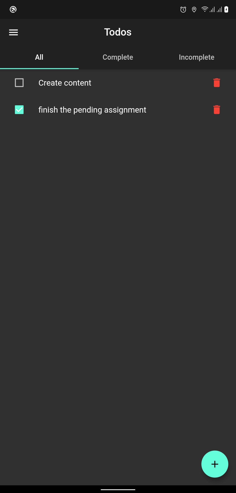
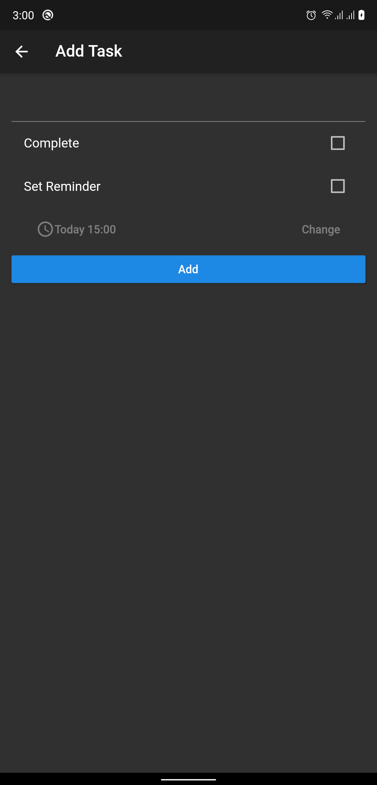

# Convoluted Todo

This is a complicated todo application which will support a ton of features over time

## Screenshot

## Purpose

If you backtrack and start from the first commit, you can see how the project evolved and how newer features were added into an existing codebase over time.

## List of features till now (from a learning POV)

* State Management using Provider
* Local Device Data Persistence using SQLite  
* Fingerprint Authentication and shared preference to enable/disable it.
* Reminder notifications for each task

## Screenshots
<pre>
    
</pre>